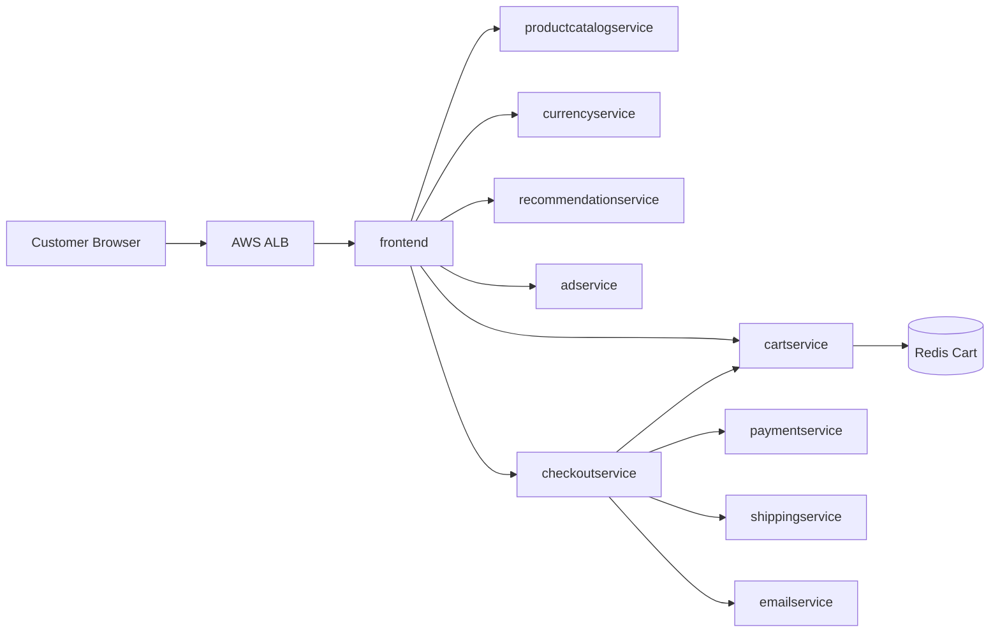

# Application Architecture

## Logical Flow

## Runtime Architecture

All user traffic terminates at an AWS Application Load Balancer managed by AWS Load Balancer Controller. Only the ALB and optional CloudFront distribution are internet-facing. Workloads run in private subnets across at least three Availability Zones. Service-to-service traffic stays inside the cluster over Kubernetes Services.

## Service Communication

Most internal services communicate over gRPC. The `frontend` service exposes HTTP externally and acts as the public entry point. Redis stores cart state and is isolated behind a ClusterIP service.

## Dev Platform Concerns

- Each service has resource requests and limits.
- Each service has liveness, readiness, and startup probes.
- Each deployment has a PodDisruptionBudget.
- Anti-affinity and topology spread constraints distribute pods across nodes and zones.
- NetworkPolicies restrict east-west communication to required service paths.
- Secrets are sourced from AWS Secrets Manager through External Secrets Operator.
- Service accounts are prepared for IRSA even where a service does not currently need AWS API access.
