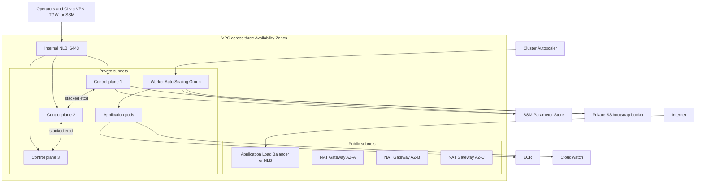

# AWS kubeadm Architecture

## Target Architecture

## Design

- Three control-plane instances run a stacked etcd topology across Availability
  Zones. An internal cross-zone NLB provides the stable API endpoint.
- Workers run in private subnets in an EC2 Auto Scaling Group backed by a Launch
  Template. Cluster Autoscaler controls desired capacity within Terraform-defined
  minimum and maximum limits.
- The first control-plane node initializes kubeadm and publishes encrypted join
  commands to SSM Parameter Store. Other nodes poll SSM and join automatically.
- Calico provides pod networking and NetworkPolicy. AWS Cloud Controller Manager
  supplies AWS node and Service integration. Metrics Server and Cluster
  Autoscaler are installed during bootstrap.
- Nodes use IMDSv2, encrypted gp3 volumes, IAM instance profiles, and SSM Session
  Manager. No inbound SSH rule is created.

## Failure Model

- Loss of one control-plane node or one Availability Zone preserves API and etcd
  quorum in a three-node production cluster.
- NLB health checks remove failed API servers.
- Worker instances are replaceable and rejoin with a non-expiring, encrypted
  bootstrap token. PodDisruptionBudgets govern application disruption.
- NAT gateways are per-AZ in stage and prod. Dev and QA intentionally use one NAT
  gateway to reduce cost.
