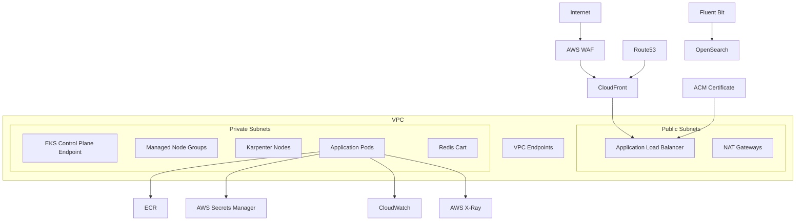

# AWS EKS Architecture

## Target Architecture

## EKS Design

- EKS cluster spans three Availability Zones.
- Public subnets host ALB and NAT gateways.
- Private subnets host all worker nodes.
- Managed node groups run baseline system and application capacity.
- Karpenter handles burst and Spot capacity.
- Control plane logging is enabled for audit, auth, API server, controller manager, and scheduler.

## Autoscaling Choice

| Capability | Cluster Autoscaler | Karpenter |
|---|---|---|
| Provisioning speed | Moderate | Fast |
| Instance diversity | Node group constrained | Broad EC2 fleet selection |
| Spot optimization | Limited | Strong |
| Operational complexity | Lower | Moderate |
| Recommendation | Keep as fallback only | Primary autoscaler |

## Network and Edge

- ALB Ingress terminates HTTPS.
- Route53 manages DNS records through External DNS.
- ACM provides public certificates.
- WAF protects public endpoints.
- CloudFront is optional for global acceleration and static caching.
- VPC endpoints reduce NAT dependency for ECR, CloudWatch, Secrets Manager, SSM, STS, and S3.

## Storage

- EBS CSI handles block storage for stateful workloads.
- EFS CSI is available for shared filesystem needs.
- Redis can remain in-cluster for compatibility or move to ElastiCache Redis for production durability.

## Identity

IRSA is mandatory for controllers and any workload requiring AWS API access. Controller roles are scoped independently for ALB, External DNS, cert-manager DNS challenges, External Secrets Operator, Fluent Bit, and Karpenter.
